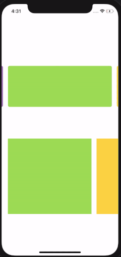

# CarouselManager
Carousel Library for UICollectionView Storyboard/XIB

Infinite scroll.



# Installation
Download and drag to project. [Download](https://github.com/blyscuit/CarouselManager/blob/master/CaroselManager/Utility/CaroselManager.swift)

# Usage
Add CaroselManager to ViewController
```
var caroselManager: CaroselManager!
```
Add following function
```
caroselManager = CaroselManager(collectionView: caroselCollectionView)
caroselManager.maxPage = viewModel.dataSource.data.value.count
caroselManager.didTapCell = { (indexPath) in
   print(indexPath.row)
}
```

# Customization
If UICollectionView parent is not full screen use the follwing method on safeArea's view
```
caroselManager = CaroselManager(collectionView: caroselCollectionView, parent: self.view)
```
